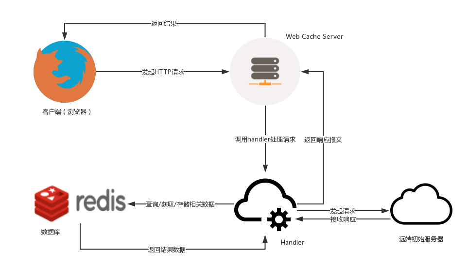
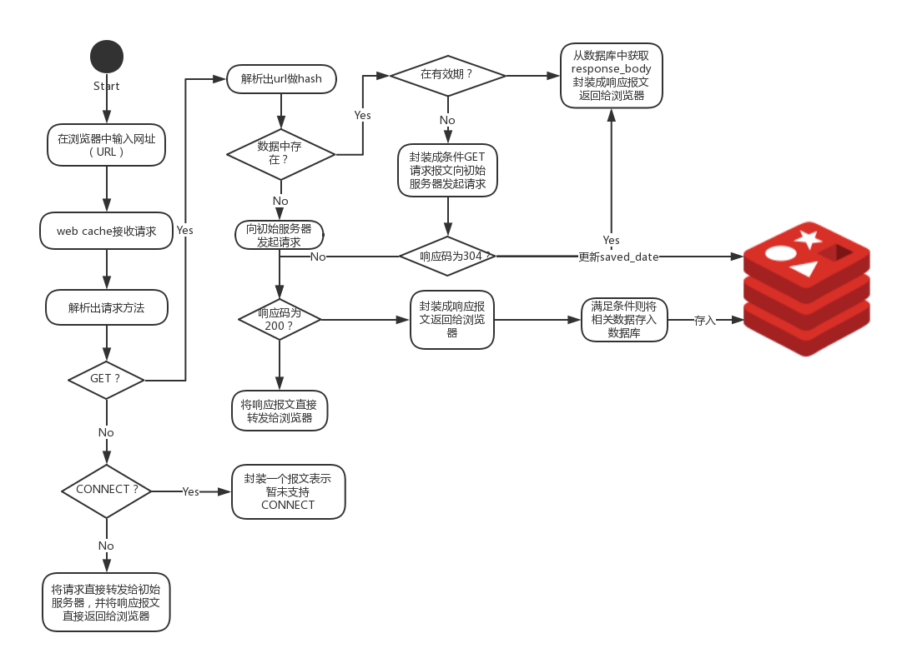

<h1>wcache: a tool that help you store requested resources</h1>

[TOC]
## Installation
`$ pip install wcache`

## Usage
- default
  `$ wcache`
- custom
  `$ wcache [--ip IP] [--port PORT]`

## Architecture

## Processing flow

## References
<https://en.wikipedia.org/wiki/Web_cache>
<https://en.wikipedia.org/wiki/Proxy_server>
